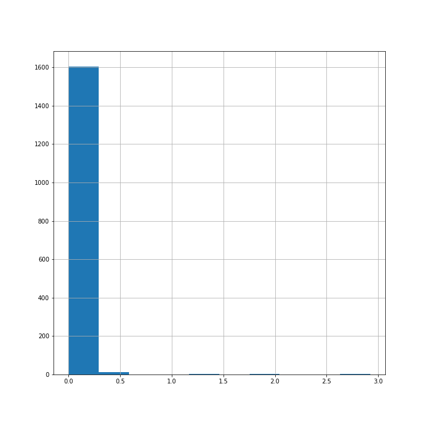
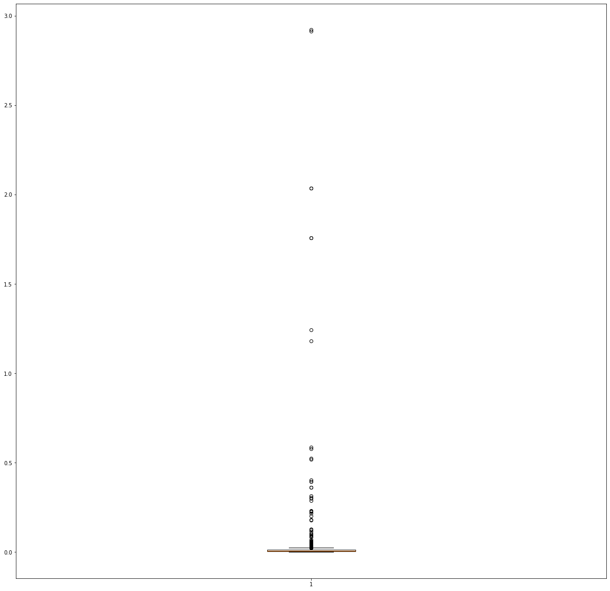

# Distance_from_KML_map_data
Distance_from_KML_map_data

# Description
## 1. KML: Keyhole Markup Language
```
The Kml file used to display the geographical data in an earch bowser such as Google each. KML is an XML notation for expressing geographic annotation and visualization within 2D maps and 3D earth browsers.
```

## 2. Problem statement
```
The provided KML map data describes the route of a vehicle. Since these are recorded using sensors, they might have incorrect measurements. The goal of this project is to read the given kml file, check out the coordinates, and with appropriate filtering logic remove the incorrect data (duplicates or outliers). And, finally calculate the distance between the coordinates and display the total distance travelled by hte vehicle in kilometers.
```

# Filtering Logic
```
The sensors records the position of the vehicle continuously by storing coordinates at each position. Since these measurements contains incorrect data which are outliers. The outliers can be find and removed using various techniques. z-score treatment, percentile technique, using empirical statistical approach, and Inter Quartile Range (IQR) technique are a few to name.

The distance points follow a skewed distribution, hence IQR proximity rule used to remove outliers.

The data points which fall below Q1 – 1.5 IQR or above Q3 + 1.5 IQR are outliers.

where Q1 and Q3 are the 25th and 75th percentile of the dataset respectively, and IQR represents the inter-quartile range and given by Q3 – Q1.


The file also containes a number of duplicate points which has no or little influence on the final distance measure and hence can be removed to optimise the calculation time.
```



# Code

## Requirements
```
- The requirements.txt file contains all the required dependencies for this project.
- python==3.70
- IDE used VS code(or your prefferred IDE)
```

## Environment setup

### Virtual environment creation
```
conda create -p distkml python==3.7 -y

```

### Activate virtual environment
```
conda activate distkml
```
OR
```
conda activate distkml/
```

## run requirements.txt for installing required libraries or packages
```
pip install -r requirements.txt
```

## code strucure
-   main.py :   runs the whole projects by running it using run button or type "python main.py" on IDE termnal and  click enter to run the project.
-   dist_log.py:    helps to create log files
-   dist_exception.py: provides exception handling
-   distance_kms.py: do all required tasks and return appropriate results.

-   kml parsing.ipynb: jupyter notebook for analysis
-   task_2_sensor: input kml file

## git action

```git clone <git_repo_url>```
```git add .```
```git commit -m "message or comment"```
```git push origin main```


